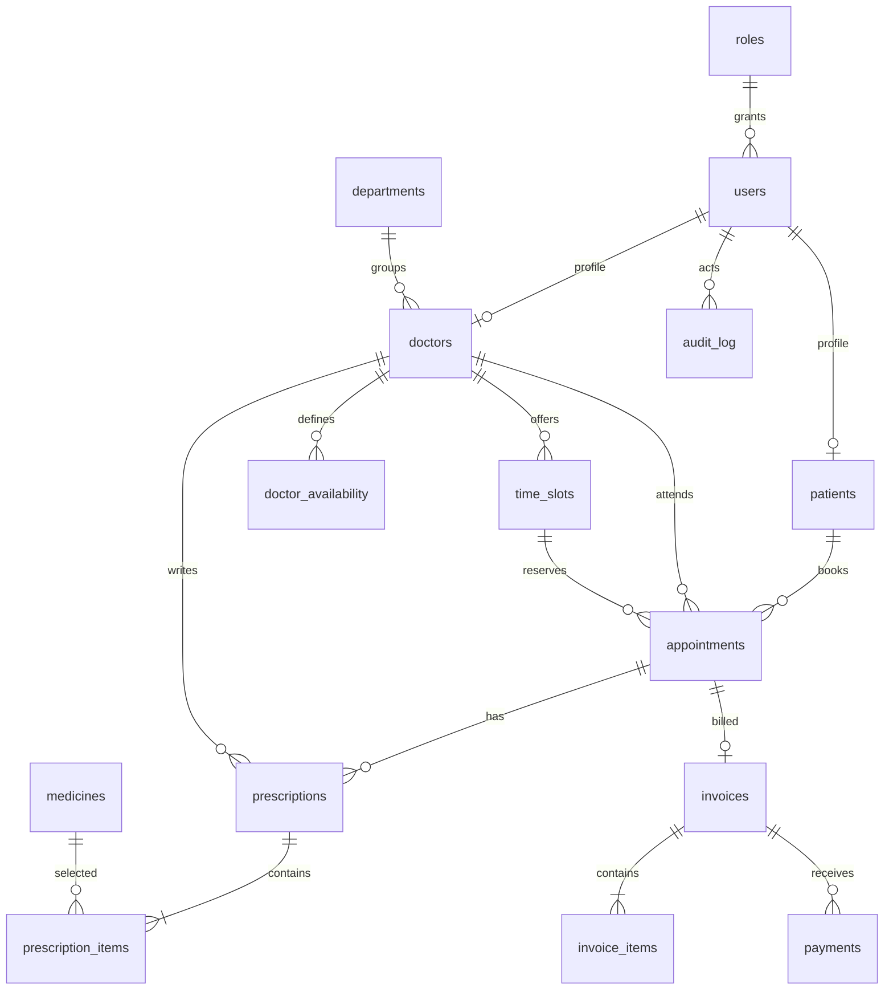

# OpenClinic database design

This is an initial schema proposal derived from the OpenClinic PRD because the workspace had no schema or backend repositories. Validate it against the evolving API before integrating database-backed routes. It uses MySQL 8.x, InnoDB, `utf8mb4`, `DECIMAL` for money, and local timestamps under the developer machine's timezone; the application timezone is assumed to be the configured clinic's local timezone until an explicit timezone setting is added.

## Entities and relationships

`roles` is the role lookup; `users` holds unique email and password hash. `patients` and `doctors` are one-to-one user profiles. `departments` group doctors. `doctor_availability` stores recurring weekday hours; `time_slots` stores dated bookable slots. `appointments` connects a patient, doctor, and slot. `medicines` and `prescription_items` normalize the many-to-many prescription/medicine relationship. One appointment can have multiple prescriptions but at most one invoice. Invoice lines store quantity and unit price, with generated `line_total`; payment rows represent partial manual payments. `audit_log` captures appointment changes.

## Important constraints and indexes

- Unique role names, user emails, one profile per user, department and medicine names.
- Foreign keys use `RESTRICT` for core records to retain history; prescription items may cascade with their prescription; optional payment/audit actor references become null when the user is removed.
- Checks reject invalid weekdays, times, durations, negative fees/prices/payments, and nonpositive quantities. MySQL 8.0.16+ enforces `CHECK` constraints.
- `appointments.active_slot_id` is a generated nullable key with a unique constraint. Booked and confirmed appointments claim their slot; cancelled, completed, and no-show records do not. This permits a cancelled slot to be booked again while retaining history.
- `time_slots` has a unique doctor/date/start time key. Foreign-key and reporting columns are indexed; avoid adding speculative indexes before observing queries.
- `v_invoice_balances` demonstrates grouped totals/payments without storing a second mutable total. Invoice status remains a service-managed state and must be updated transactionally with payments.

## Transactions and concurrency

`book_appointment` inserts only an active, future, available slot for an active doctor, inside a transaction. The unique generated active slot key remains the concurrency guard if two sessions race. A duplicate-key error should be mapped by the API to HTTP 409. The procedure does not itself manage actor identity; set connection-scoped `@openclinic_actor_user_id` before changes if the actor should be captured in triggers.

Invoice creation, line insertion, and payments must share a transaction. Lock the invoice row while checking paid amount and updating status; calculate totals from invoice lines and payments. Patient/doctor identity and status eligibility must also be checked in service logic and foreign keys.

## Normalization and demonstrations

The design separates role/user/profile data, repeating availability, appointment booking, prescription medicine items, invoice lines, and payments to avoid repeating groups and update anomalies (1NF–3NF). The views demonstrate joins and grouped balances; the appointment procedure demonstrates DDL, transactions, and guarded DML; unique/check/foreign-key constraints demonstrate integrity; indexes support lookups. Use `EXPLAIN` on actual schedule and report queries. `seed.sql` demonstrates idempotent inserts. No arbitrary SQL runner is provided.

## Known integration decisions to confirm

The current FastAPI workspace has no auth or workflow repositories, so this schema establishes an initial contract rather than matching existing query code. Confirm whether clinic timezone is local-only, whether the API uses numeric or UUID identifiers, and how booking authentication supplies the patient ID before enabling routes. Demo login users need bcrypt hashes generated by backend code and are not inserted by the current reference seed.

## Schema review against PRD (2025-10-02)

### Coverage status
- All 15 required entities from PRD §8.1 present: `roles`, `users`, `patients`, `departments`, `doctors`, `doctor_availability`, `time_slots`, `appointments`, `medicines`, `prescriptions`, `prescription_items`, `invoices`, `invoice_items`, `payments`, `audit_log`
- All 10 key relationships from PRD §8.2 implemented with FK constraints
- Double-booking prevention via `active_slot_id` generated column + unique constraint (PRD FR-20) ✓
- `book_appointment` stored procedure with transaction (PRD FR-24) ✓
- `DECIMAL(10,2)` for money, `utf8mb4`, InnoDB, CHECK constraints (PRD §8.3) ✓

### Live verification results (2025-10-02)
MySQL 8.0.46, database `openclinic_db`, user `openclinic_app`:
- Foreign key constraints enforce referential integrity ✓
- CHECK constraints reject invalid values ✓
- `active_slot_id` VIRTUAL generated column + unique index prevents double-booking ✓ (changed from STORED due to MySQL 8.0 limitation: STORED generated columns cannot reference FK columns on some versions)
- `book_appointment` procedure books only active, future, available slots for active doctors ✓
- Audit triggers capture INSERT/UPDATE on `appointments` with `@openclinic_actor_user_id` ✓
- Views `v_daily_appointment_schedule` and `v_invoice_balances` return correct joins/aggregates ✓

### Frontend integration status (2025-10-02)
React + Vite + TypeScript + Tailwind frontend scaffolded at `frontend/`:
- Vite dev server at `http://localhost:5173` with proxy `/api/*` → `http://localhost:8000`
- Centralized API client (`src/api/client.ts`) with JWT auth, auto-headers, 401 redirect
- AuthContext for login/register/logout/me state, role-based route guards
- Patient portal pages: Landing, Login, Register, Dashboard, Doctors (filterable), Book Appointment (date + slot selection), My Appointments (upcoming/past tabs, cancel), Prescriptions, Invoices, Profile
- Staff panel placeholder with 9 feature cards (Appointment Mgmt, Patient Search, Prescriptions, Billing, Reports, Audit Log, DBMS Explorer, Doctor Mgmt, Department Mgmt)
- `/health` page displays live API and MySQL connectivity with version info
- Frontend → Vite proxy → Backend → MySQL verified: `GET /api/v1/health/database` returns `{"success":true,"data":{"status":"connected","version":"8.0.46","database_name":"openclinic_db"},"error":null}`

### Gaps to address before backend integration
1. **Audit triggers incomplete** (PRD FR-39): Only `appointments` covered. Need triggers for `invoices` and `payments`.
2. **Invoice status automation** (PRD FR-34): No trigger to auto-update `invoices.status` when payments change. `v_invoice_balances` view computes balance but status must stay consistent.
3. **Missing stored procedures**:
   - Slot generation from `doctor_availability` (PRD FR-18)
   - Appointment cancellation/rescheduling with 2-hour cutoff (PRD FR-22, FR-23)
   - Invoice creation + line items in transaction (PRD FR-30, FR-35)
   - Payment recording with invoice status update (PRD FR-31, FR-35)
4. **`book_appointment` procedure** does not capture actor for audit (`@openclinic_actor_user_id`).
5. **Missing `users_grants.sql`** for MySQL application user creation and least-privilege grants (PRD repo structure).
6. **Report views**: Need appointment counts by date/doctor/department (PRD FR-36) and revenue summaries (PRD FR-37).
7. **DBMS Explorer metadata queries** needed for admin read-only access (PRD FR-43–47).
